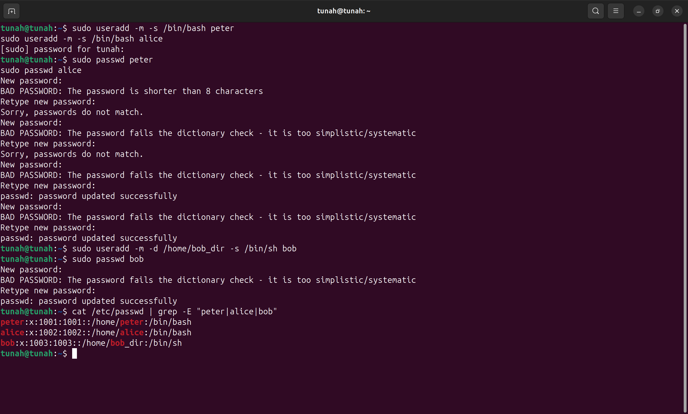
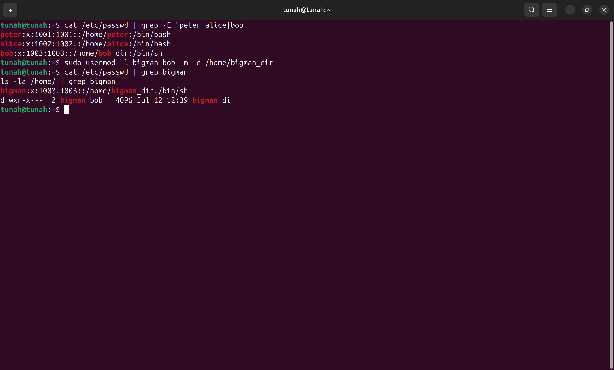
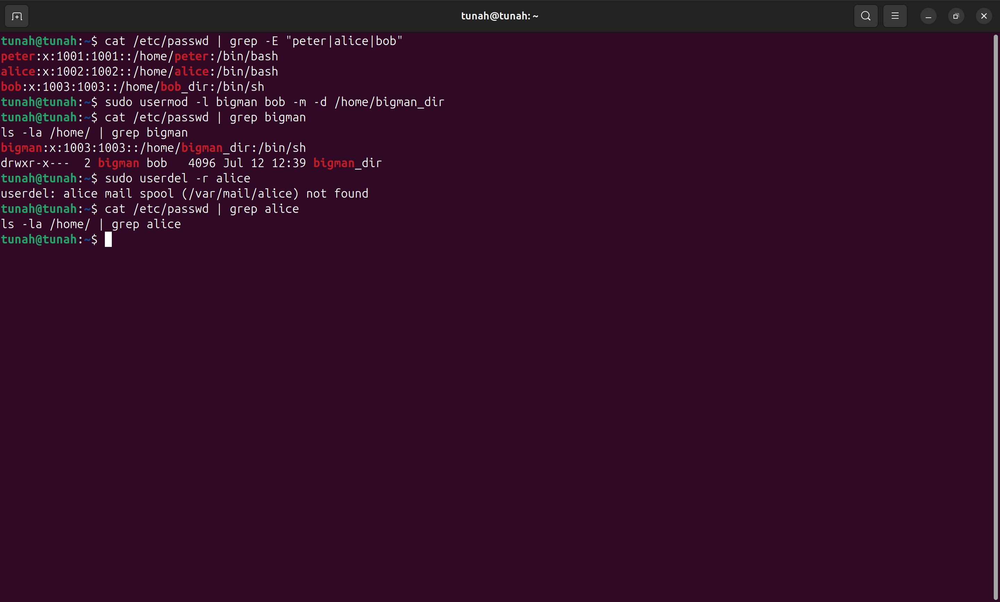
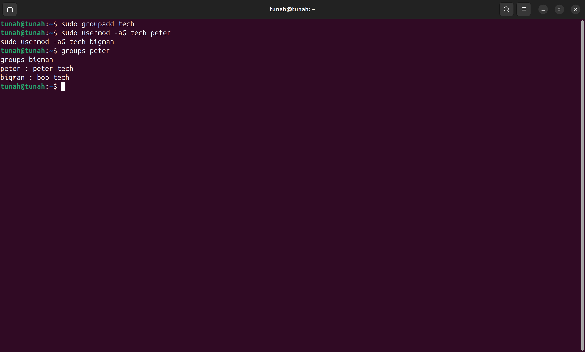
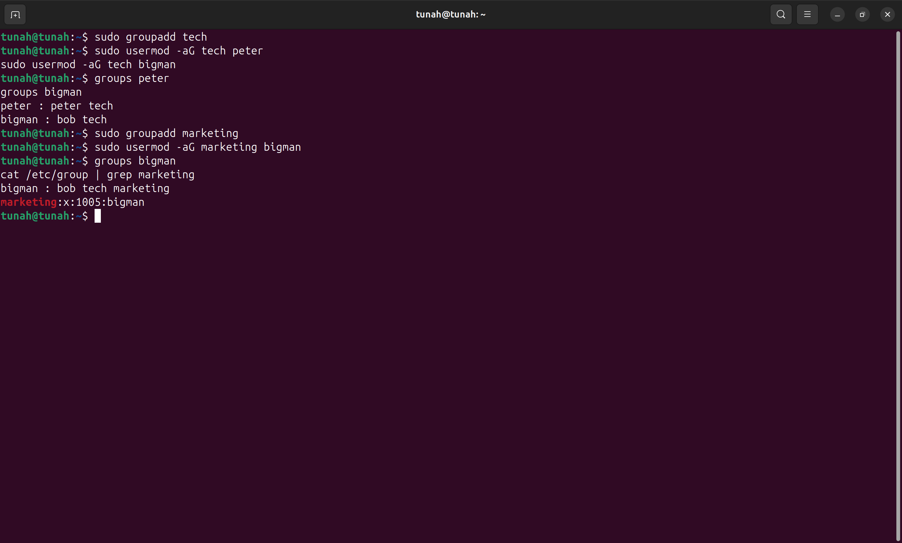
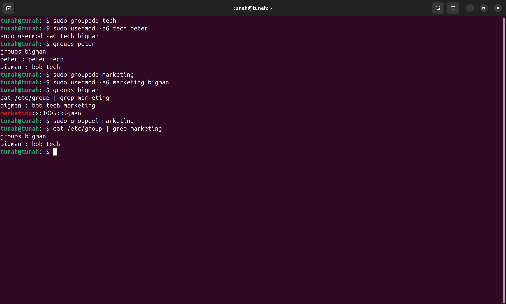

# Báo cáo: User & Group

## Bài tập 1: Tạo và quản lý user

### Yêu cầu
- Tạo user `peter` và `alice`: thiết lập mật khẩu, thư mục home tự động, shell `/bin/bash`.
- Tạo user `bob`: thiết lập mật khẩu, thư mục home `/home/bob_dir`, shell `/bin/sh`.
- Đổi tên user `bob` → `bigman`, đổi thư mục home → `/home/bigman_dir`, chuyển dữ liệu sang thư mục mới.
- Xóa user `alice` và thư mục home.

### Hướng dẫn thực hiện

#### Bước 1: Tạo user peter và alice

```bash
sudo useradd -m -s /bin/bash peter
sudo useradd -m -s /bin/bash alice
```

- `-m`: tạo thư mục home tự động (`/home/peter`, `/home/alice`)
- `-s /bin/bash`: đặt shell mặc định là `/bin/bash`

#### Bước 2: Đặt mật khẩu cho peter và alice

```bash
sudo passwd peter
sudo passwd alice
```

> Hệ thống sẽ yêu cầu nhập mật khẩu 2 lần để xác nhận.

#### Bước 3: Tạo user bob

```bash
sudo useradd -m -d /home/bob_dir -s /bin/sh bob
```

- `-d /home/bob_dir`: chỉ định thư mục home cụ thể.
- `-s /bin/sh`: shell mặc định là `/bin/sh`.

#### Bước 4: Đặt mật khẩu cho bob

```bash
sudo passwd bob
```

#### Bước 5: Kiểm tra danh sách user đã tạo

```bash
cat /etc/passwd | grep -E "peter|alice|bob"
```

📸 **Screenshot 1**: Chụp kết quả lệnh trên — cho thấy 3 user `peter`, `alice`, `bob` đã được tạo thành công với đúng home directory và shell.



#### Bước 6: Đổi tên user bob → bigman và di chuyển thư mục home

```bash
sudo usermod -l bigman bob -m -d /home/bigman_dir
```

- `-l bigman`: đổi tên login từ `bob` → `bigman`.
- `-m -d /home/bigman_dir`: di chuyển toàn bộ dữ liệu từ `/home/bob_dir` sang `/home/bigman_dir`.

#### Bước 7: Kiểm tra sau khi đổi tên

```bash
cat /etc/passwd | grep bigman
ls -la /home/ | grep bigman
```

📸 **Screenshot 2**: Chụp kết quả — cho thấy user `bigman` tồn tại với home directory `/home/bigman_dir`.



#### Bước 8: Xóa user alice

```bash
sudo userdel -r alice
```

- `-r`: xóa cả thư mục home `/home/alice`.

#### Bước 9: Xác nhận alice đã bị xóa

```bash
cat /etc/passwd | grep alice
ls -la /home/ | grep alice
```

📸 **Screenshot 3**: Chụp kết quả — lệnh grep không trả về kết quả, chứng tỏ user `alice` và thư mục home đã bị xóa.



---

## Bài tập 2: Tạo và quản lý group

### Yêu cầu
- Tạo group `tech`: thêm user `peter` và `bigman` vào group.
- Tạo group `marketing`: thêm user `bigman` vào group.
- Xóa group `marketing`.

### Hướng dẫn thực hiện

#### Bước 1: Tạo group tech

```bash
sudo groupadd tech
```

#### Bước 2: Thêm user peter và bigman vào group tech

```bash
sudo usermod -aG tech peter
sudo usermod -aG tech bigman
```

- `-aG`: append (thêm vào) group mà không ảnh hưởng các group khác của user.

#### Bước 3: Kiểm tra group tech

```bash
groups peter
groups bigman
```

📸 **Screenshot 4**: Chụp kết quả — cho thấy cả `peter` và `bigman` đều thuộc group `tech`.



#### Bước 4: Tạo group marketing và thêm bigman

```bash
sudo groupadd marketing
sudo usermod -aG marketing bigman
```

#### Bước 5: Kiểm tra group marketing

```bash
groups bigman
cat /etc/group | grep marketing
```

📸 **Screenshot 5**: Chụp kết quả — cho thấy `bigman` thuộc cả group `tech` và `marketing`.



#### Bước 6: Xóa group marketing

```bash
sudo groupdel marketing
```

#### Bước 7: Xác nhận group marketing đã bị xóa

```bash
cat /etc/group | grep marketing
groups bigman
```

📸 **Screenshot 6**: Chụp kết quả — lệnh grep không trả về kết quả cho `marketing`, `bigman` chỉ còn thuộc group `tech`.



---

## Tổng hợp Screenshot cần chụp

| # | Nội dung screenshot | Lệnh liên quan |
|---|---------------------|-----------------|
| 1 | Danh sách 3 user peter, alice, bob đã tạo | `cat /etc/passwd \| grep -E "peter\|alice\|bob"` |
| 2 | User bigman với home /home/bigman_dir | `cat /etc/passwd \| grep bigman` + `ls -la /home/` |
| 3 | Xác nhận alice đã bị xóa | `cat /etc/passwd \| grep alice` + `ls -la /home/` |
| 4 | peter và bigman thuộc group tech | `groups peter` + `groups bigman` |
| 5 | bigman thuộc group marketing | `groups bigman` + `cat /etc/group \| grep marketing` |
| 6 | Xác nhận group marketing đã bị xóa | `cat /etc/group \| grep marketing` + `groups bigman` |
