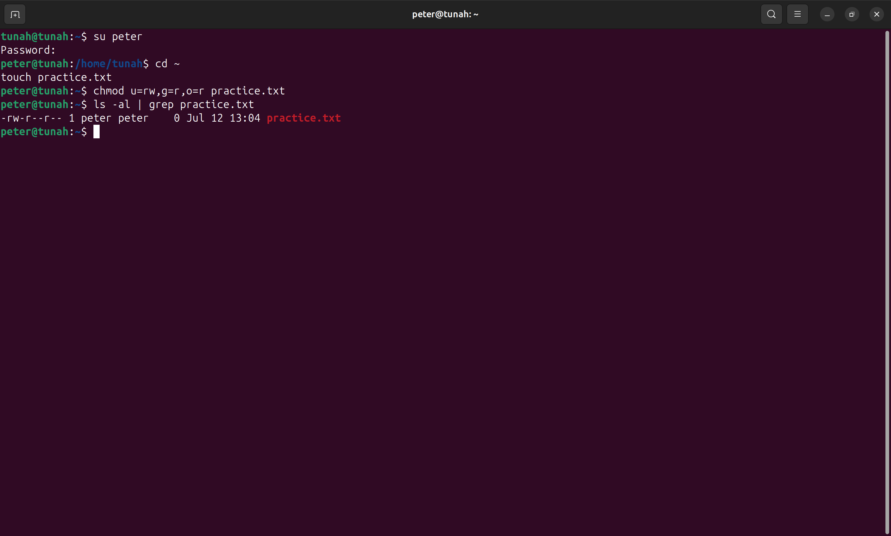
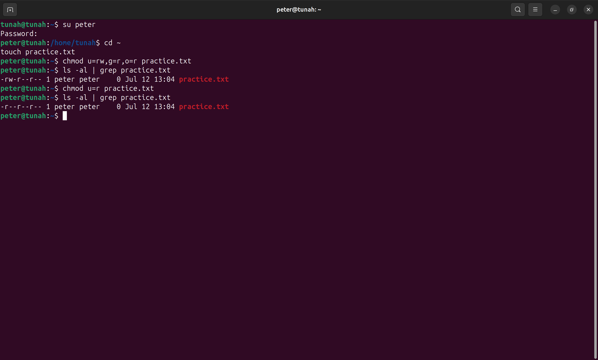
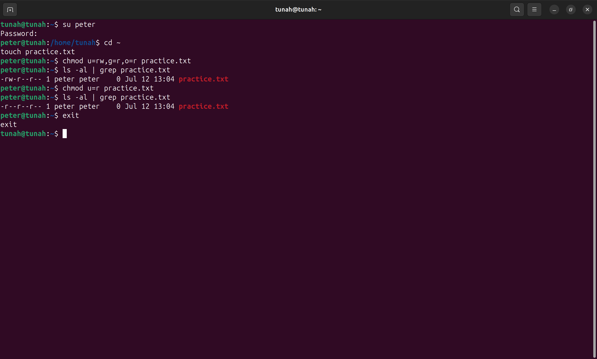
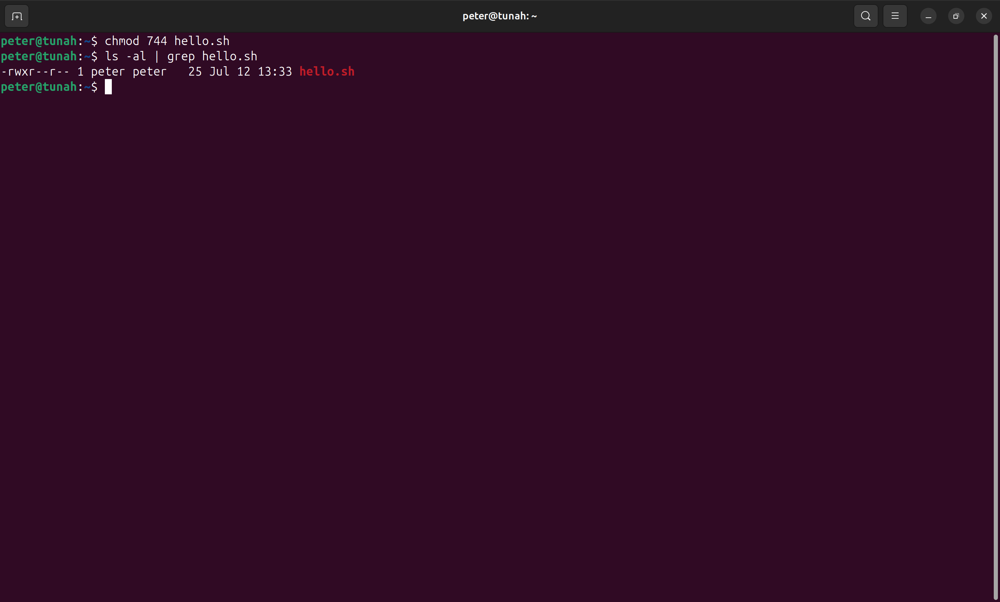
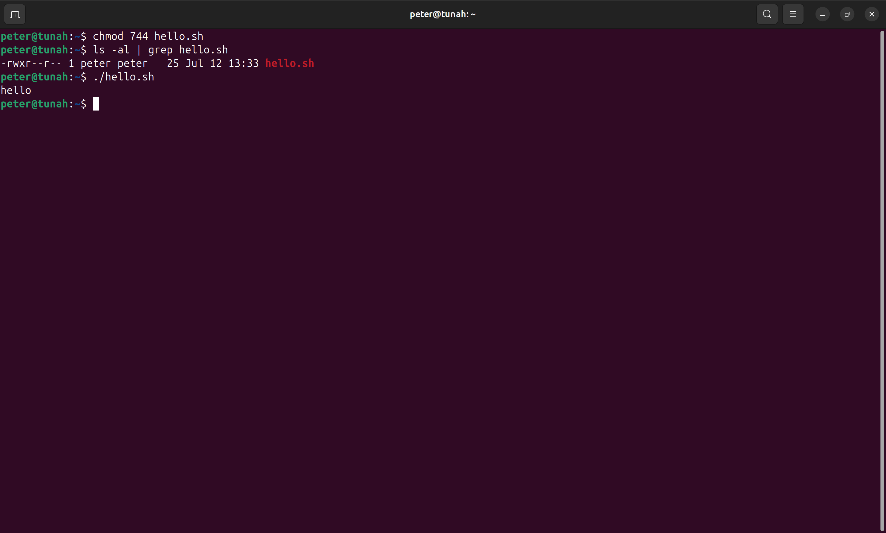

# Báo cáo: Phân quyền file và thư mục

## Bài tập 1: Phân quyền thư mục với ký hiệu tượng trưng (symbolic)

### Yêu cầu
- Đăng nhập vào user `peter`, tạo file `practice.txt` trong thư mục home.
- Thay đổi quyền: owner có quyền đọc + ghi, group và other chỉ có quyền đọc.
- Kiểm tra phân quyền, sau đó đổi owner chỉ còn quyền đọc (group và other giữ nguyên).

### Hướng dẫn thực hiện

#### Bước 1: Đăng nhập vào user peter

```bash
su peter
```

> Nhập mật khẩu của user `peter` đã tạo ở phần trước.

#### Bước 2: Tạo file practice.txt

```bash
cd ~
touch practice.txt
```

#### Bước 3: Phân quyền cho file — owner (rw), group (r), other (r)

```bash
chmod u=rw,g=r,o=r practice.txt
```

- `u=rw`: owner có quyền **read** + **write**
- `g=r`: group chỉ có quyền **read**
- `o=r`: other chỉ có quyền **read**

#### Bước 4: Kiểm tra phân quyền

```bash
ls -al | grep practice.txt
```

📸 **Screenshot 1**: Chụp kết quả — file hiển thị quyền `-rw-r--r--`, xác nhận phân quyền đúng yêu cầu.



#### Bước 5: Đổi quyền owner chỉ còn đọc

```bash
chmod u=r practice.txt
```

#### Bước 6: Kiểm tra lại phân quyền

```bash
ls -al | grep practice.txt
```

📸 **Screenshot 2**: Chụp kết quả — file hiển thị quyền `-r--r--r--`, owner chỉ còn quyền đọc.



#### Bước 7: Thoát user peter

```bash
exit
```

---

## Bài tập 2: Tạo và thay đổi quyền cho file bằng số học (octal)

### Yêu cầu
- Đăng nhập vào user `peter`, tạo file `hello.sh` trong thư mục home.
- Thay đổi quyền: owner có rwx, group và other chỉ có r.
- Thực thi file để kiểm tra.

### Hướng dẫn thực hiện

#### Bước 1: Đăng nhập vào user peter

```bash
su peter
cd ~
```

#### Bước 2: Tạo file hello.sh

```bash
cat <<EOF >hello.sh
#!/bin/bash
echo 'hello'
EOF
```

#### Bước 3: Kiểm tra nội dung file

```bash
cat hello.sh
```

📸 **Screenshot 3**: Chụp kết quả `cat hello.sh` — cho thấy nội dung script.



#### Bước 4: Phân quyền bằng octal — 744

```bash
chmod 744 hello.sh
```

Giải thích hệ thống octal:
- `7` (owner) = **r**(4) + **w**(2) + **x**(1) = đọc + ghi + thực thi
- `4` (group) = **r**(4) = chỉ đọc
- `4` (other) = **r**(4) = chỉ đọc

#### Bước 5: Kiểm tra phân quyền

```bash
ls -al | grep hello.sh
```

📸 **Screenshot 4**: Chụp kết quả — file hiển thị quyền `-rwxr--r--`.



#### Bước 6: Thực thi file

```bash
./hello.sh
```

📸 **Screenshot 5**: Chụp kết quả — terminal hiển thị `hello`, chứng tỏ script thực thi thành công.



#### Bước 7: Thoát user peter

```bash
exit
```

---

## Tổng hợp Screenshot cần chụp

| # | Nội dung screenshot | Lệnh liên quan |
|---|---------------------|-----------------|
| 1 | File practice.txt có quyền `-rw-r--r--` | `ls -al \| grep practice.txt` |
| 2 | File practice.txt đổi thành `-r--r--r--` | `ls -al \| grep practice.txt` |
| 3 | Nội dung file hello.sh | `cat hello.sh` |
| 4 | File hello.sh có quyền `-rwxr--r--` | `ls -al \| grep hello.sh` |
| 5 | Kết quả thực thi hello.sh in ra "hello" | `./hello.sh` |
