# Báo cáo: Quản lý xuất nhập file

## Bài tập 1: Tạo và ghi nội dung vào file

### Yêu cầu
Tạo file `myfile.txt` và ghi nội dung "Hello, Linux!" vào file.

### Thực hiện

```bash
echo "Hello, Linux!" > myfile.txt
```

- `>`: toán tử redirect — ghi đè nội dung vào file (tạo file nếu chưa tồn tại).

📸 **Screenshot 1**: Chụp kết quả lệnh tạo file, sau đó xem nội dung bằng `cat myfile.txt` để xác nhận.

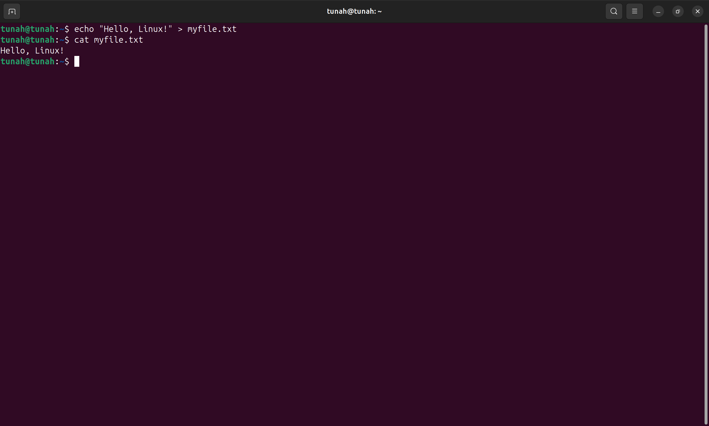

---

## Bài tập 2: Xem nội dung file

### Yêu cầu
Xem nội dung file `myfile.txt`.

### Thực hiện

```bash
cat myfile.txt
```

📸 **Screenshot 2**: Chụp kết quả — terminal hiển thị "Hello, Linux!".

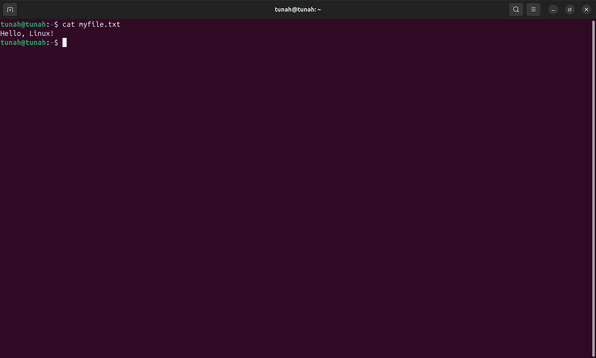

---

## Bài tập 3: Ghi thêm nội dung vào file

### Yêu cầu
Thêm dòng "Welcome to Linux file management." vào cuối file mà **không ghi đè** nội dung cũ.

### Thực hiện

```bash
echo "Welcome to Linux file management." >> myfile.txt
```

- `>>`: toán tử append — thêm nội dung vào cuối file, không ghi đè.

Kiểm tra:

```bash
cat myfile.txt
```

📸 **Screenshot 3**: Chụp kết quả `cat` — file có 2 dòng: "Hello, Linux!" và "Welcome to Linux file management.".

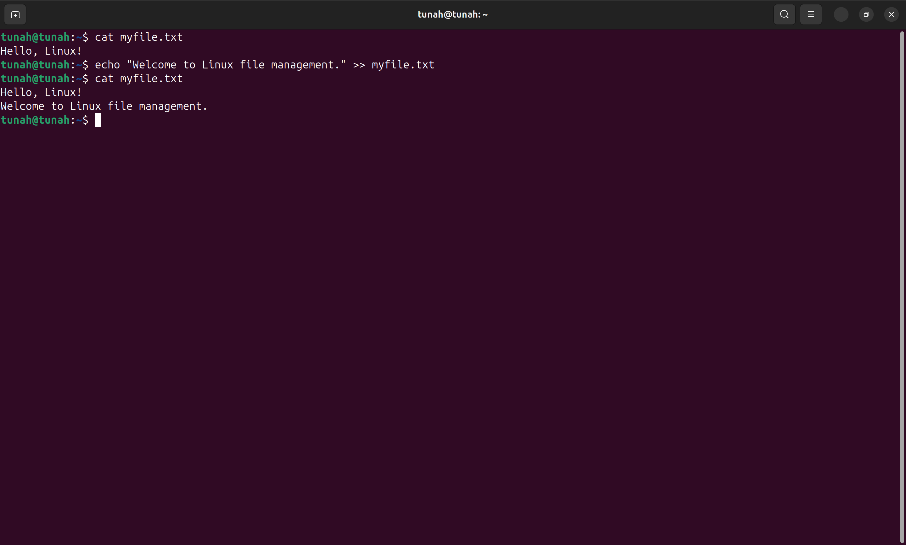

---

## Bài tập 4: Đếm số dòng trong file

### Yêu cầu
Đếm số dòng trong file `myfile.txt`.

### Thực hiện

```bash
wc -l myfile.txt
```

- `wc -l`: đếm số dòng (lines).

📸 **Screenshot 4**: Chụp kết quả — hiển thị `2 myfile.txt`.

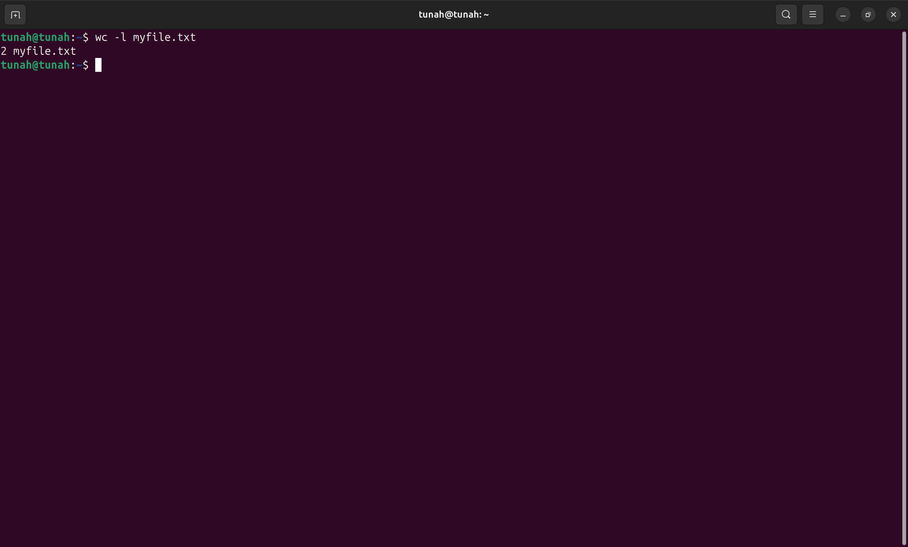

---

## Bài tập 5: Đếm số từ trong file

### Yêu cầu
Đếm số từ có trong file `myfile.txt`.

### Thực hiện

```bash
wc -w myfile.txt
```

- `wc -w`: đếm số từ (words).

📸 **Screenshot 5**: Chụp kết quả — hiển thị số lượng từ trong file.

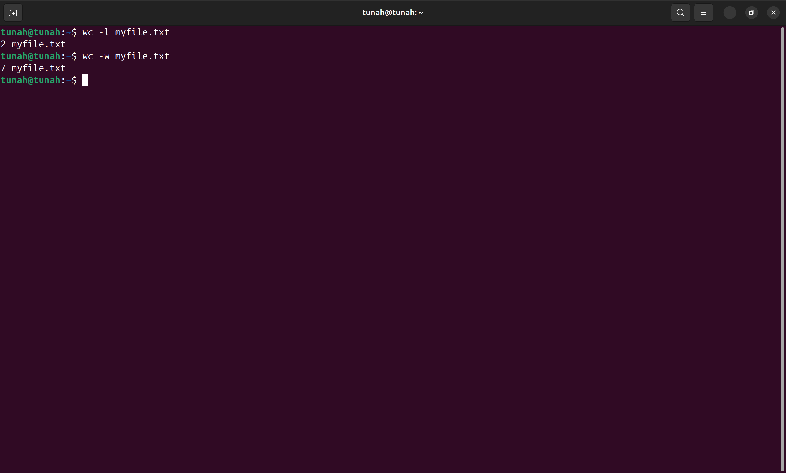

---

## Bài tập 6: Sao chép file

### Yêu cầu
Sao chép file `myfile.txt` thành `myfile_backup.txt`.

### Thực hiện

```bash
cp myfile.txt myfile_backup.txt
```

Kiểm tra:

```bash
ls -al myfile*
```

📸 **Screenshot 6**: Chụp kết quả `ls` — cho thấy cả 2 file `myfile.txt` và `myfile_backup.txt` tồn tại.

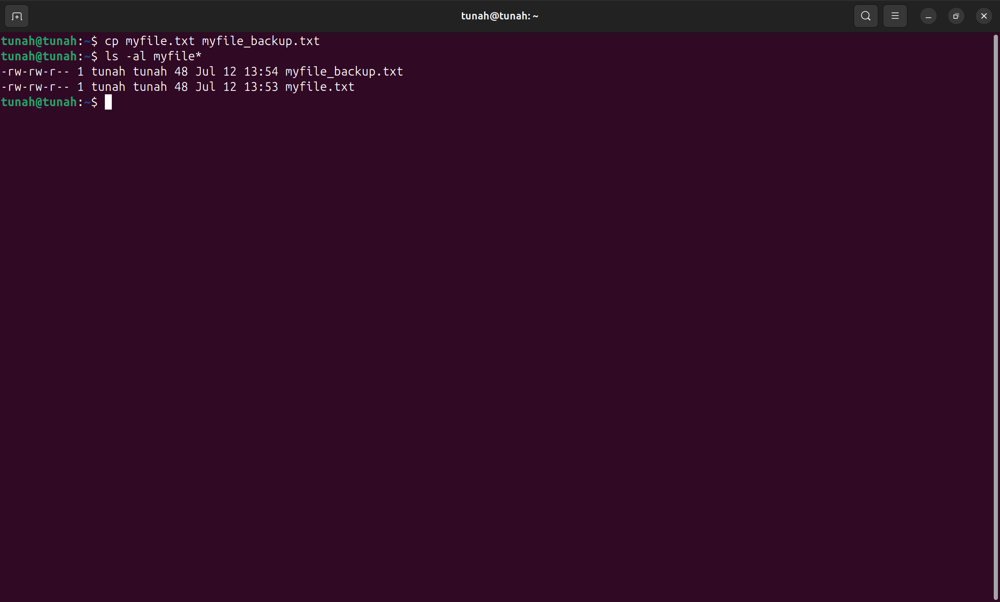

---

## Bài tập 7: Di chuyển file

### Yêu cầu
Di chuyển file `myfile_backup.txt` vào thư mục `/tmp`.

### Thực hiện

```bash
mv myfile_backup.txt /tmp/
```

Kiểm tra:

```bash
ls /tmp/myfile_backup.txt
```

📸 **Screenshot 7**: Chụp kết quả — file `myfile_backup.txt` đã nằm trong `/tmp/`.

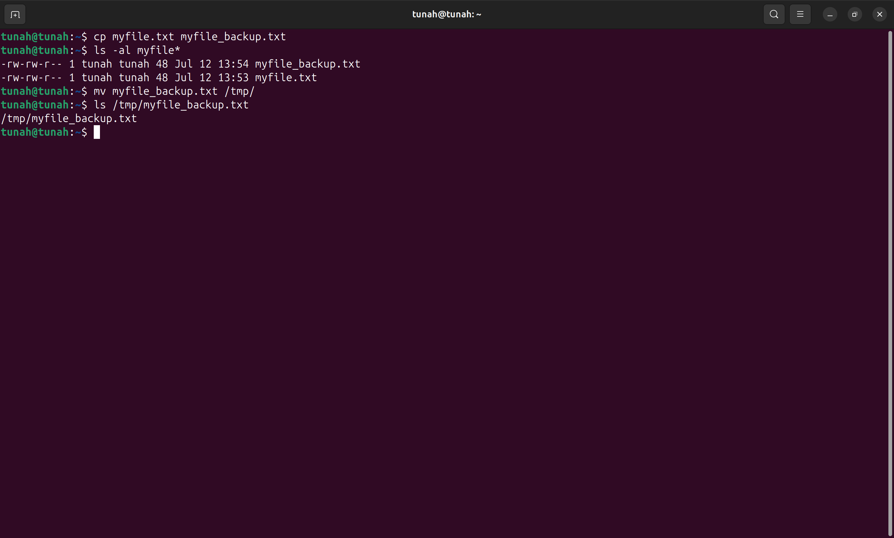

---

## Bài tập 8: Xóa file

### Yêu cầu
Xóa file `myfile.txt`.

### Thực hiện

```bash
rm myfile.txt
```

Kiểm tra:

```bash
ls myfile.txt
```

📸 **Screenshot 8**: Chụp kết quả — lệnh `ls` báo "No such file or directory", chứng tỏ file đã bị xóa.

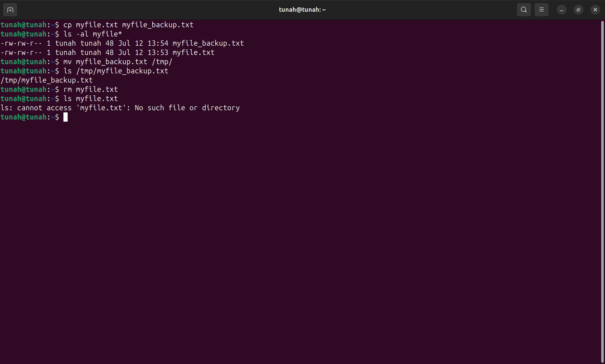

---

## Bài tập 9: Hiển thị các file trong thư mục

### Yêu cầu
Hiển thị tất cả file và thư mục (bao gồm file ẩn) trong thư mục hiện tại.

### Thực hiện

```bash
ls -al
```

- `-a`: hiển thị cả file ẩn (bắt đầu bằng `.`)
- `-l`: hiển thị dạng danh sách chi tiết (quyền, owner, size, ngày...)

📸 **Screenshot 9**: Chụp kết quả `ls -al` — danh sách đầy đủ các file bao gồm `.` và `..`.

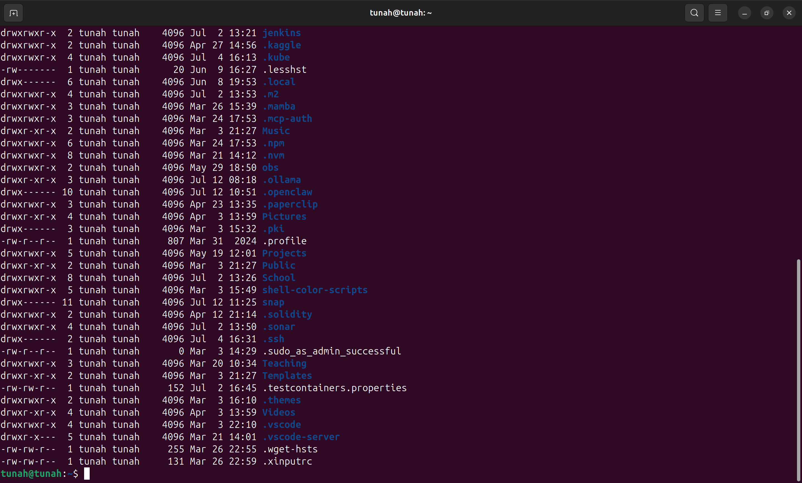`.

---

## Bài tập 10: Tìm kiếm chuỗi trong file

### Yêu cầu
Tìm kiếm chuỗi "Linux" trong file `/tmp/myfile_backup.txt`.

### Thực hiện

```bash
grep "Linux" /tmp/myfile_backup.txt
```

📸 **Screenshot 10**: Chụp kết quả — dòng chứa "Linux" được highlight/hiển thị.

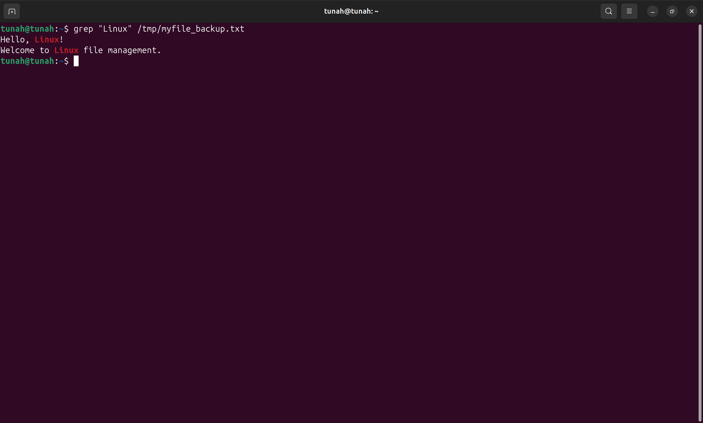

---

## Bài tập 11: Đổi tên file

### Yêu cầu
Đổi tên `myfile_backup.txt` thành `linuxfile.txt` (trong `/tmp`).

### Thực hiện

```bash
mv /tmp/myfile_backup.txt /tmp/linuxfile.txt
```

Kiểm tra:

```bash
ls /tmp/linuxfile.txt
```

📸 **Screenshot 11**: Chụp kết quả — file `linuxfile.txt` tồn tại trong `/tmp/`.

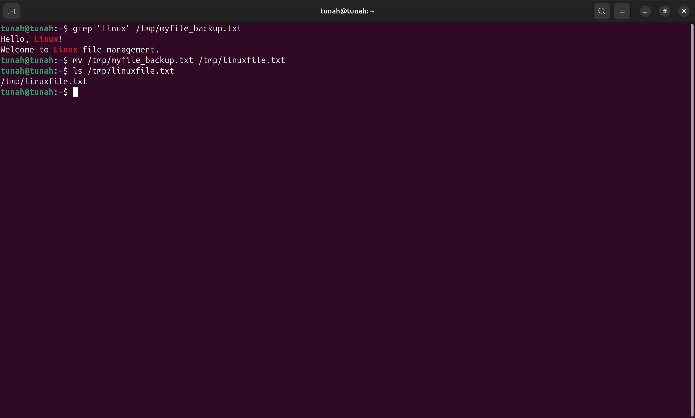

---

## Bài tập 12: Tạo thư mục và di chuyển file vào thư mục

### Yêu cầu
Tạo thư mục `backup` trong thư mục hiện tại và di chuyển file `linuxfile.txt` vào.

### Thực hiện

```bash
mkdir backup
mv /tmp/linuxfile.txt backup/
```

Kiểm tra:

```bash
ls -la backup/
```

📸 **Screenshot 12**: Chụp kết quả — thư mục `backup/` chứa file `linuxfile.txt`.

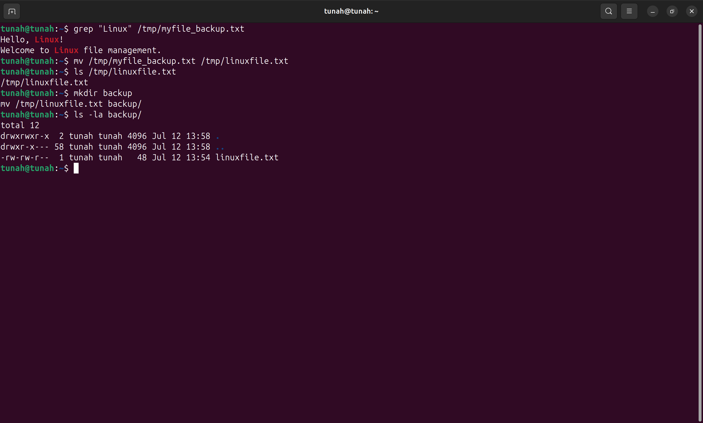

---

## Bài tập 13: Hiển thị nội dung file theo từng phần

### Yêu cầu
Hiển thị nội dung file `linuxfile.txt` trong thư mục `backup` từng trang một.

### Thực hiện

```bash
less backup/linuxfile.txt
```

> Nhấn `q` để thoát, `Space` để chuyển trang, mũi tên để cuộn.

📸 **Screenshot 13**: Chụp màn hình `less` đang hiển thị nội dung file.

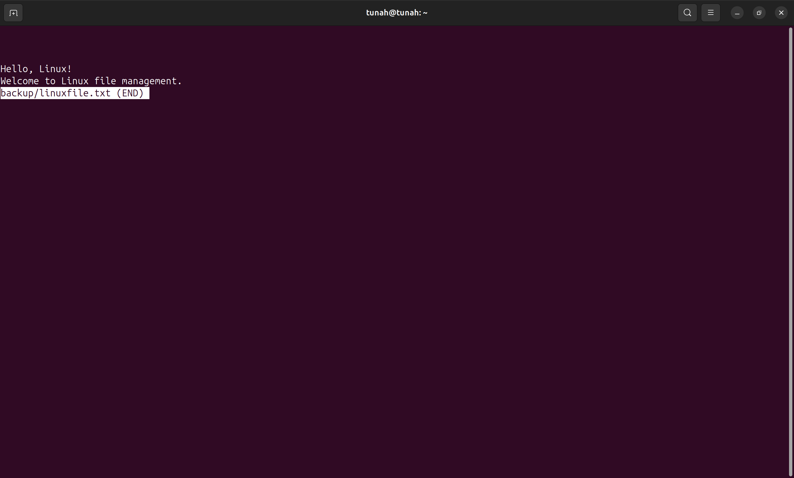

---

## Tổng hợp Screenshot cần chụp

| # | Nội dung screenshot | Lệnh liên quan |
|---|---------------------|-----------------|
| 1 | Tạo file và xem nội dung | `echo "Hello, Linux!" > myfile.txt` + `cat myfile.txt` |
| 2 | Xem nội dung file | `cat myfile.txt` |
| 3 | File có 2 dòng sau khi append | `cat myfile.txt` |
| 4 | Đếm số dòng | `wc -l myfile.txt` |
| 5 | Đếm số từ | `wc -w myfile.txt` |
| 6 | 2 file sau khi sao chép | `ls -al myfile*` |
| 7 | File đã di chuyển sang /tmp | `ls /tmp/myfile_backup.txt` |
| 8 | File đã bị xóa | `ls myfile.txt` |
| 9 | Liệt kê toàn bộ file kể cả ẩn | `ls -al` |
| 10 | Tìm chuỗi "Linux" | `grep "Linux" /tmp/myfile_backup.txt` |
| 11 | File đã đổi tên | `ls /tmp/linuxfile.txt` |
| 12 | File nằm trong thư mục backup | `ls -la backup/` |
| 13 | Hiển thị nội dung bằng less | `less backup/linuxfile.txt` |
