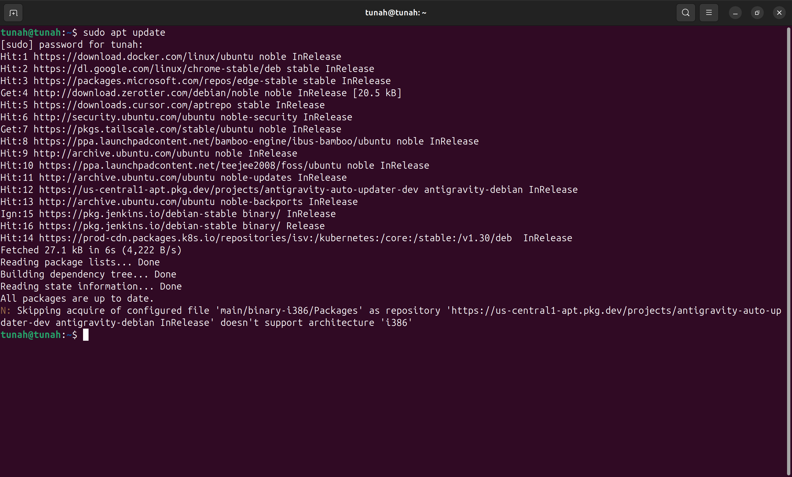
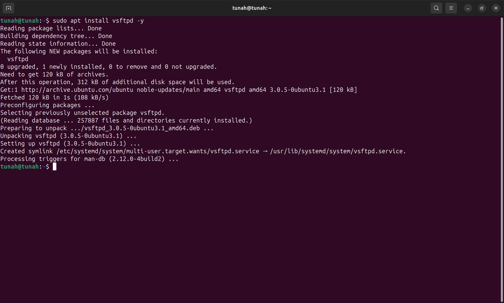
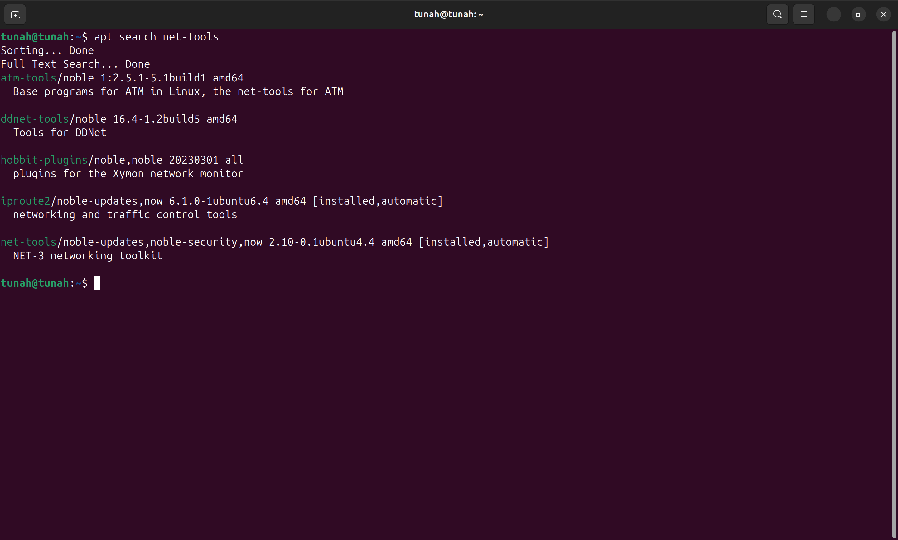
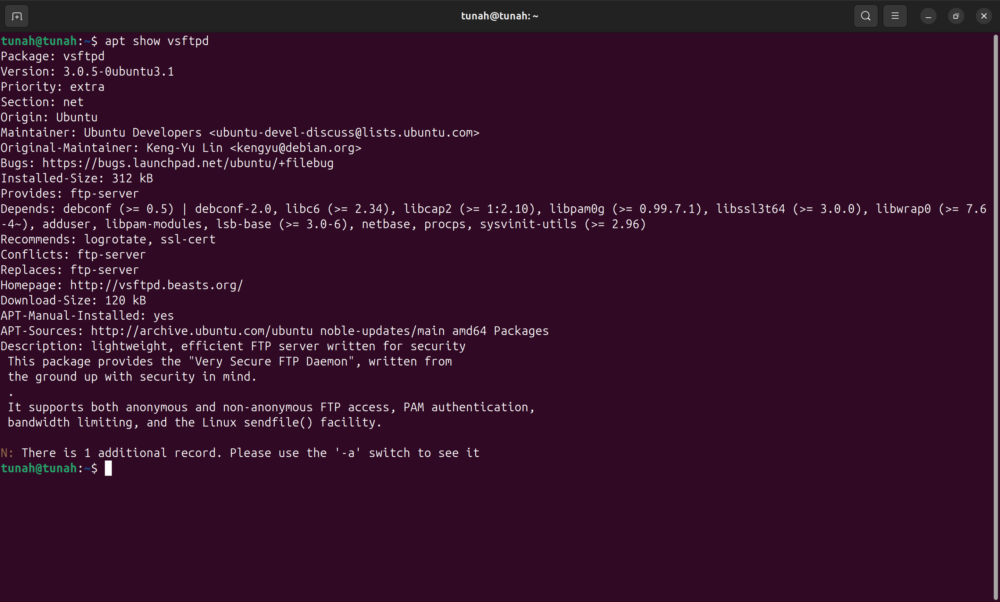
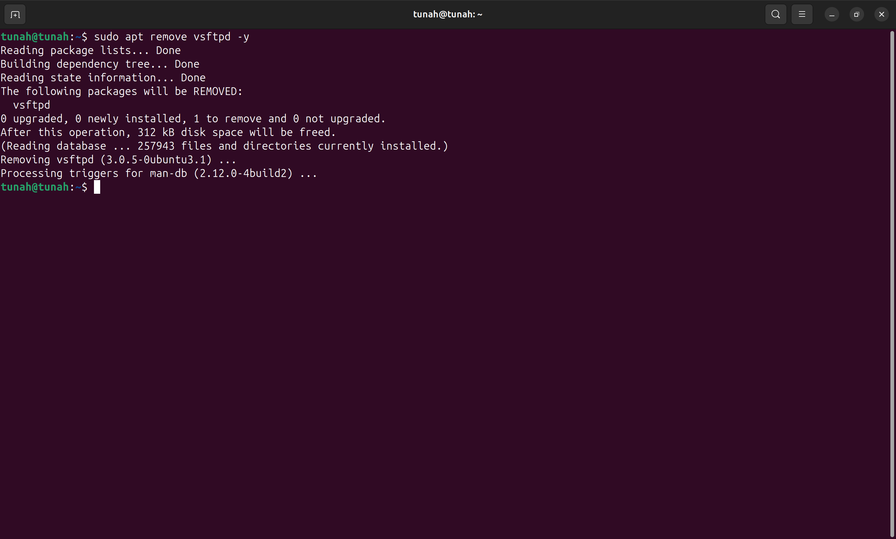
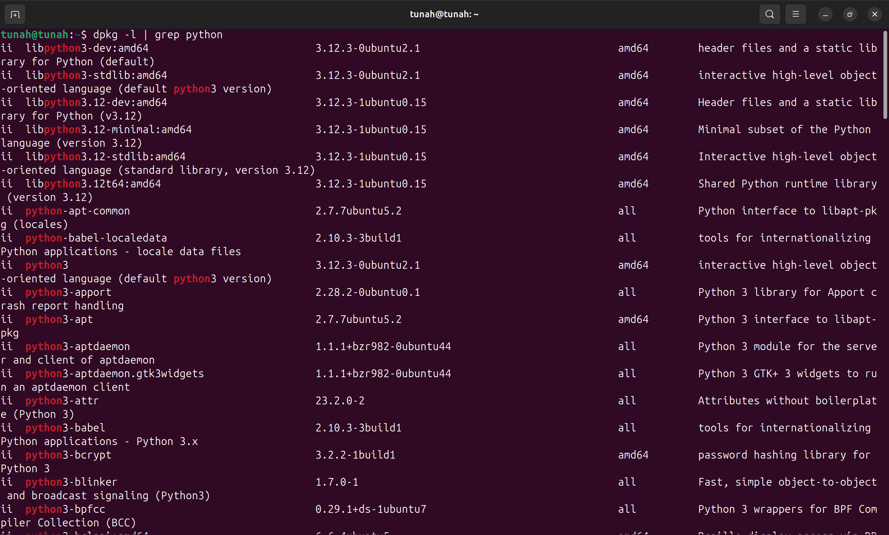
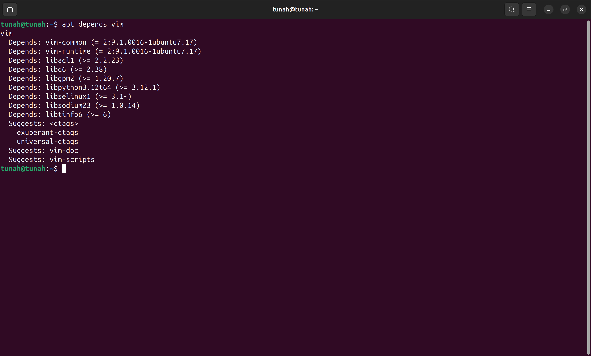
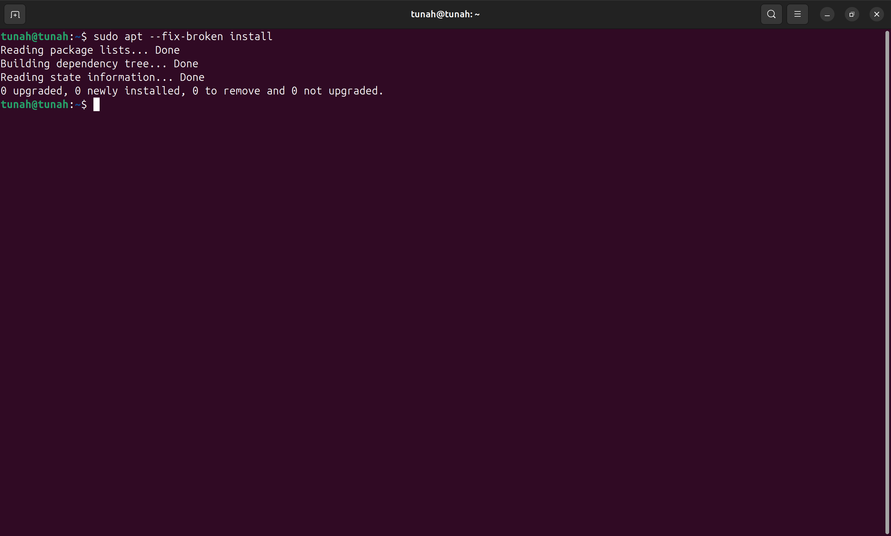
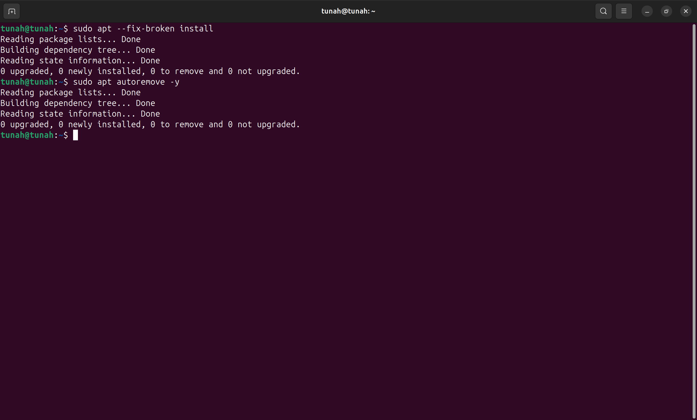

# Báo cáo: Quản lý gói phần mềm

> **Lưu ý:** Các câu lệnh dưới đây dành cho hệ điều hành Ubuntu 22.04 LTS. Các lệnh `apt` cần quyền `sudo`.

## Bài tập 1: Cập nhật danh sách gói phần mềm

### Yêu cầu
Cập nhật danh sách các gói phần mềm có sẵn trên hệ thống trước khi cài đặt.

### Thực hiện

```bash
sudo apt update
```

📸 **Screenshot 1**: Chụp kết quả — hiển thị quá trình cập nhật danh sách gói, số gói có thể upgrade.



---

## Bài tập 2: Cài đặt một gói phần mềm

### Yêu cầu
Cài đặt gói phần mềm `vsftpd`.

### Thực hiện

```bash
sudo apt install vsftpd -y
```

- `-y`: tự động xác nhận cài đặt.

📸 **Screenshot 2**: Chụp kết quả — quá trình cài đặt `vsftpd` thành công.



---

## Bài tập 3: Tìm kiếm gói phần mềm

### Yêu cầu
Tìm kiếm gói phần mềm có tên hoặc mô tả chứa từ khóa `net-tools`.

### Thực hiện

```bash
apt search net-tools
```

📸 **Screenshot 3**: Chụp kết quả — danh sách các gói liên quan đến `net-tools`.



---

## Bài tập 4: Hiển thị thông tin gói phần mềm

### Yêu cầu
Kiểm tra thông tin chi tiết của gói `vsftpd` (phiên bản, nhà phát triển, gói phụ thuộc).

### Thực hiện

```bash
apt show vsftpd
```

📸 **Screenshot 4**: Chụp kết quả — thông tin chi tiết gồm Version, Maintainer, Depends,...



---

## Bài tập 5: Gỡ bỏ gói phần mềm

### Yêu cầu
Gỡ bỏ gói phần mềm `vsftpd` khỏi hệ thống.

### Thực hiện

```bash
sudo apt remove vsftpd -y
```

📸 **Screenshot 5**: Chụp kết quả — quá trình gỡ bỏ thành công.



---

## Bài tập 6: Tìm kiếm các gói phần mềm đã cài đặt

### Yêu cầu
Liệt kê tất cả các gói đã cài đặt có tên chứa từ khóa `python`.

### Thực hiện

```bash
dpkg -l | grep python
```

- `dpkg -l`: liệt kê tất cả gói đã cài đặt.
- `grep python`: lọc các gói có chứa từ "python".

📸 **Screenshot 6**: Chụp kết quả — danh sách các gói python đã cài đặt.



---

## Bài tập 7: Liệt kê các gói phụ thuộc

### Yêu cầu
Kiểm tra và liệt kê các gói phụ thuộc mà `vim` cần để hoạt động.

### Thực hiện

```bash
apt depends vim
```

📸 **Screenshot 7**: Chụp kết quả — cây phụ thuộc (dependency tree) của `vim`.



---

## Bài tập 8: Kiểm tra các gói phần mềm bị hỏng hoặc lỗi

### Yêu cầu
Kiểm tra và sửa chữa các gói phần mềm bị lỗi hoặc hỏng.

### Thực hiện

```bash
sudo apt --fix-broken install
```

📸 **Screenshot 8**: Chụp kết quả — hệ thống báo cáo không có lỗi hoặc đã sửa lỗi thành công.



---

## Bài tập 9: Xóa các gói phần mềm không cần thiết

### Yêu cầusudo apt autoremove -y
Xóa các gói phần mềm không còn cần thiết để giải phóng không gian.

### Thực hiện

```bash
sudo apt autoremove -y
```

📸 **Screenshot 9**: Chụp kết quả — danh sách các gói bị xóa hoặc thông báo "0 to remove" nếu không có gói thừa.



---

## Tổng hợp Screenshot cần chụp

| # | Nội dung screenshot | Lệnh liên quan |
|---|---------------------|-----------------|
| 1 | Kết quả cập nhật danh sách gói | `sudo apt update` |
| 2 | Quá trình cài đặt vsftpd | `sudo apt install vsftpd -y` |
| 3 | Kết quả tìm kiếm net-tools | `apt search net-tools` |
| 4 | Thông tin chi tiết gói vsftpd | `apt show vsftpd` |
| 5 | Quá trình gỡ bỏ vsftpd | `sudo apt remove vsftpd -y` |
| 6 | Danh sách gói python đã cài | `dpkg -l \| grep python` |
| 7 | Cây phụ thuộc của vim | `apt depends vim` |
| 8 | Kiểm tra/sửa gói lỗi | `sudo apt --fix-broken install` |
| 9 | Xóa gói không cần thiết | `sudo apt autoremove -y` |
