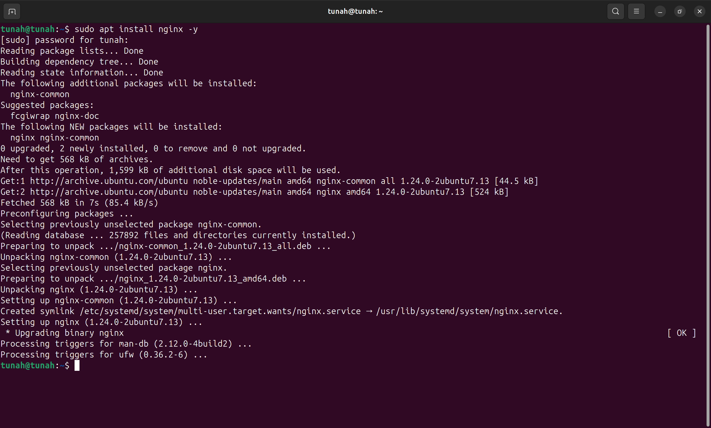
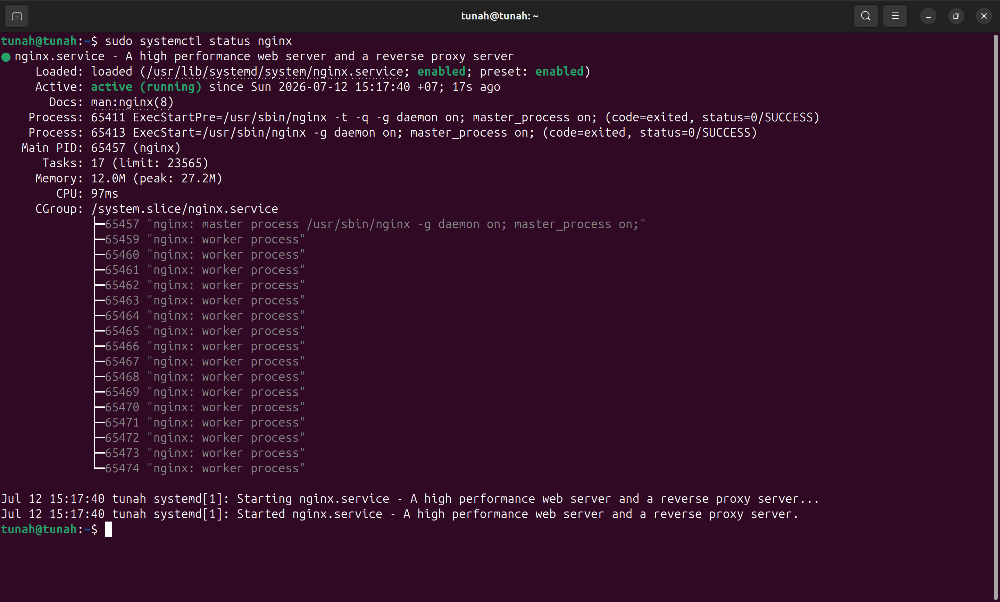
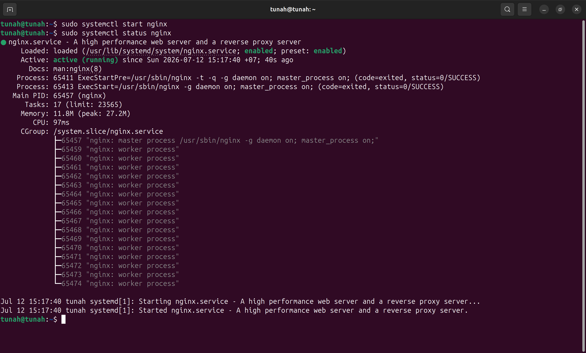
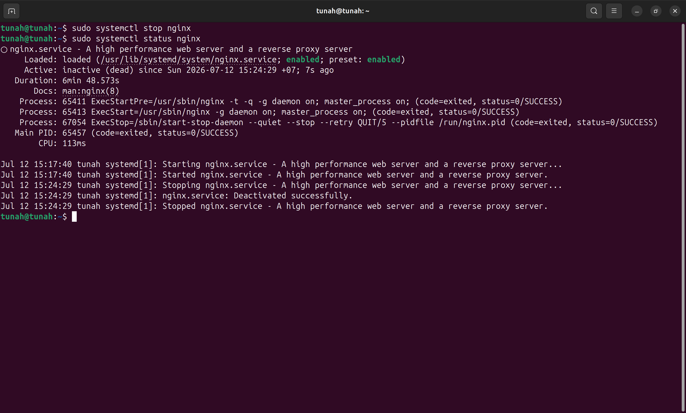
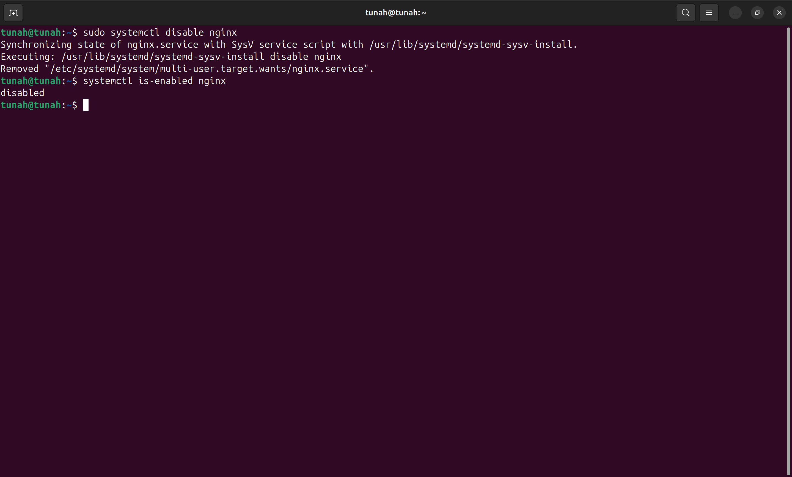
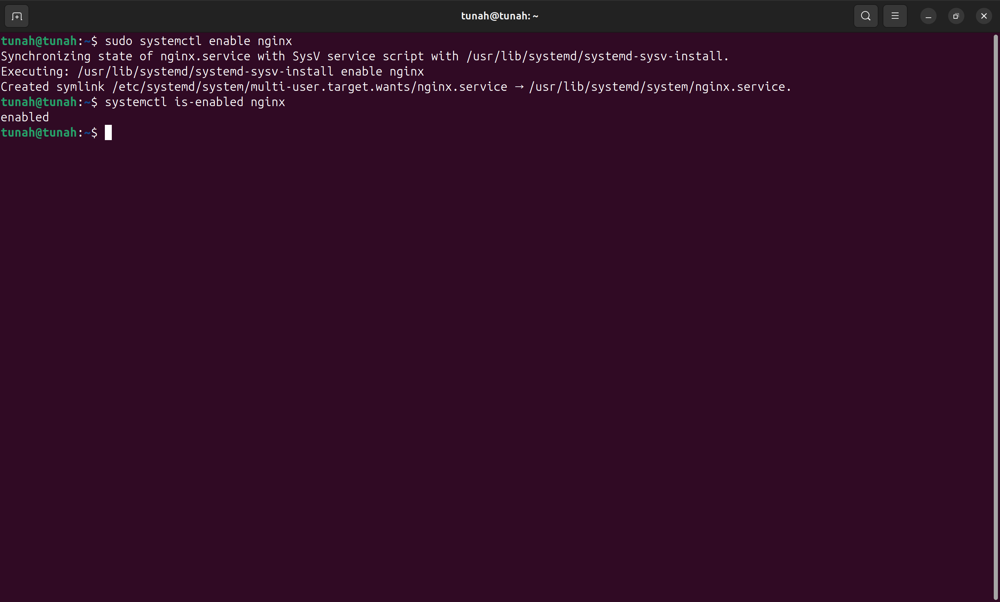
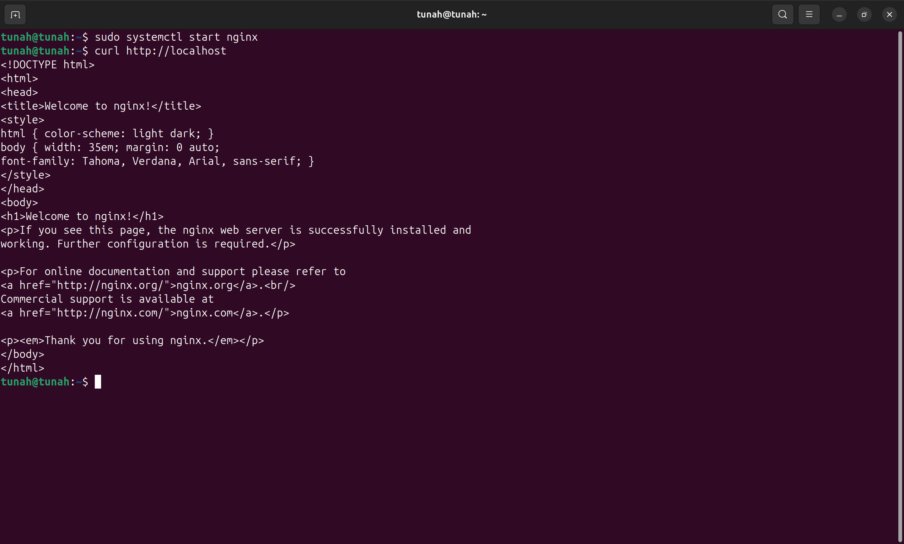
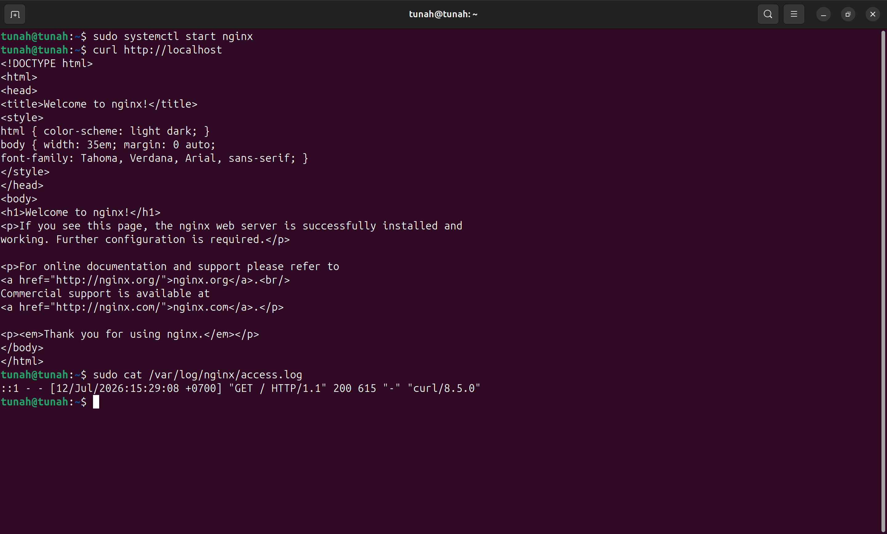
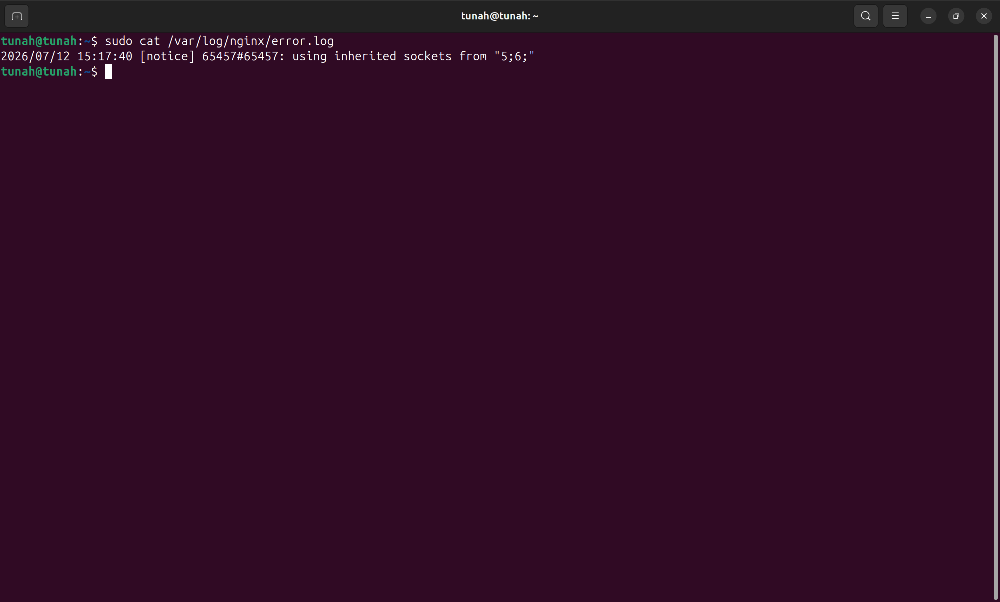
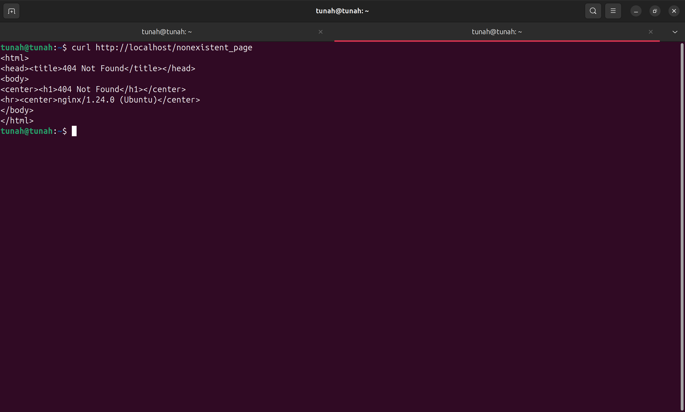

# Báo cáo: Quản lý dịch vụ (Service Management)

## Bài tập 1: Quản lý dịch vụ Nginx

### Yêu cầu
- Cài đặt `nginx` trên hệ thống.
- Kiểm tra trạng thái, khởi động và dừng dịch vụ bằng `systemctl`.

### Hướng dẫn thực hiện

#### Bước 1: Cài đặt nginx

```bash
sudo apt install nginx -y
```

📸 **Screenshot 1**: Chụp kết quả cài đặt nginx thành công.



#### Bước 2: Kiểm tra trạng thái nginx

```bash
sudo systemctl status nginx
```

📸 **Screenshot 2**: Chụp kết quả — trạng thái `active (running)` hoặc `inactive`, hiển thị PID, memory,...



#### Bước 3: Khởi động nginx (nếu đang inactive)

```bash
sudo systemctl start nginx
```

Kiểm tra lại:

```bash
sudo systemctl status nginx
```

📸 **Screenshot 3**: Chụp kết quả — trạng thái chuyển sang `active (running)`.



#### Bước 4: Dừng nginx

```bash
sudo systemctl stop nginx
```

Kiểm tra lại:

```bash
sudo systemctl status nginx
```

📸 **Screenshot 4**: Chụp kết quả — trạng thái chuyển sang `inactive (dead)`.



---

## Bài tập 2: Cấu hình tự động khởi động dịch vụ

### Yêu cầu
Bật và tắt chế độ tự động khởi động của nginx khi hệ thống boot.

### Hướng dẫn thực hiện

#### Bước 1: Tắt chế độ tự khởi động

```bash
sudo systemctl disable nginx
```

#### Bước 2: Kiểm tra trạng thái enable

```bash
systemctl is-enabled nginx
```

📸 **Screenshot 5**: Chụp kết quả — hiển thị `disabled`.



#### Bước 3: Bật lại chế độ tự khởi động

```bash
sudo systemctl enable nginx
```

#### Bước 4: Kiểm tra lại

```bash
systemctl is-enabled nginx
```

📸 **Screenshot 6**: Chụp kết quả — hiển thị `enabled`.



---

## Bài tập 3: Kiểm tra file log truy cập của Nginx

### Yêu cầu
Kiểm tra các truy cập gần đây vào server Nginx.

### Hướng dẫn thực hiện

#### Bước 1: Khởi động nginx (nếu chưa chạy)

```bash
sudo systemctl start nginx
```

#### Bước 2: Tạo một truy cập bằng curl

```bash
curl http://localhost
```

📸 **Screenshot 7**: Chụp kết quả `curl` — hiển thị HTML mặc định của nginx (Welcome to nginx!).



#### Bước 3: Kiểm tra access log

```bash
sudo cat /var/log/nginx/access.log
```

📸 **Screenshot 8**: Chụp kết quả — dòng log ghi nhận truy cập từ `127.0.0.1` vừa thực hiện.



---

## Bài tập 4: Kiểm tra file log lỗi của Nginx

### Yêu cầu
Kiểm tra các lỗi gần đây liên quan đến Nginx.

### Thực hiện

```bash
sudo cat /var/log/nginx/error.log
```

📸 **Screenshot 9**: Chụp kết quả — nội dung error log (có thể trống nếu chưa có lỗi, hoặc hiển thị các warning/error).



---

## Bài tập 5: Xem log lỗi trong thời gian thực

### Yêu cầu
Theo dõi log lỗi của Nginx trong thời gian thực.

### Thực hiện

```bash
sudo tail -f /var/log/nginx/error.log
```

> Mở **terminal thứ 2** và thực hiện truy cập vào một URL không tồn tại để tạo lỗi:
> ```bash
> curl http://localhost/nonexistent_page
> ```

📸 **Screenshot 10**: Chụp kết quả — terminal hiển thị `tail -f` đang chạy và dòng log lỗi mới xuất hiện (404 error). Nhấn `Ctrl+C` để thoát.



---

## Tổng hợp Screenshot cần chụp

| # | Nội dung screenshot | Lệnh liên quan |
|---|---------------------|-----------------|
| 1 | Cài đặt nginx thành công | `sudo apt install nginx -y` |
| 2 | Trạng thái nginx ban đầu | `sudo systemctl status nginx` |
| 3 | Nginx đang chạy (active) | `sudo systemctl start nginx` + `status` |
| 4 | Nginx đã dừng (inactive) | `sudo systemctl stop nginx` + `status` |
| 5 | Nginx disabled | `systemctl is-enabled nginx` |
| 6 | Nginx enabled | `systemctl is-enabled nginx` |
| 7 | Kết quả curl localhost | `curl http://localhost` |
| 8 | Access log ghi nhận truy cập | `sudo cat /var/log/nginx/access.log` |
| 9 | Error log | `sudo cat /var/log/nginx/error.log` |
| 10 | Theo dõi log realtime | `sudo tail -f /var/log/nginx/error.log` |
