# Báo cáo: Quản lý tác vụ tự động bằng Bash Script

## Bài tập 1: Script in "Hello World"

### Yêu cầu
Tạo script `hello.sh` in ra dòng chữ "Hello World".

### Thực hiện

#### Bước 1: Tạo file script

```bash
cat <<EOF > hello.sh
#!/bin/bash
echo "Hello World"
EOF
```

#### Bước 2: Cấp quyền thực thi

```bash
chmod +x hello.sh
```

#### Bước 3: Chạy script

```bash
./hello.sh
```

📸 **Screenshot 1**: Chụp lệnh tạo file, `cat hello.sh` để xem nội dung, và kết quả chạy `./hello.sh` hiển thị "Hello World".

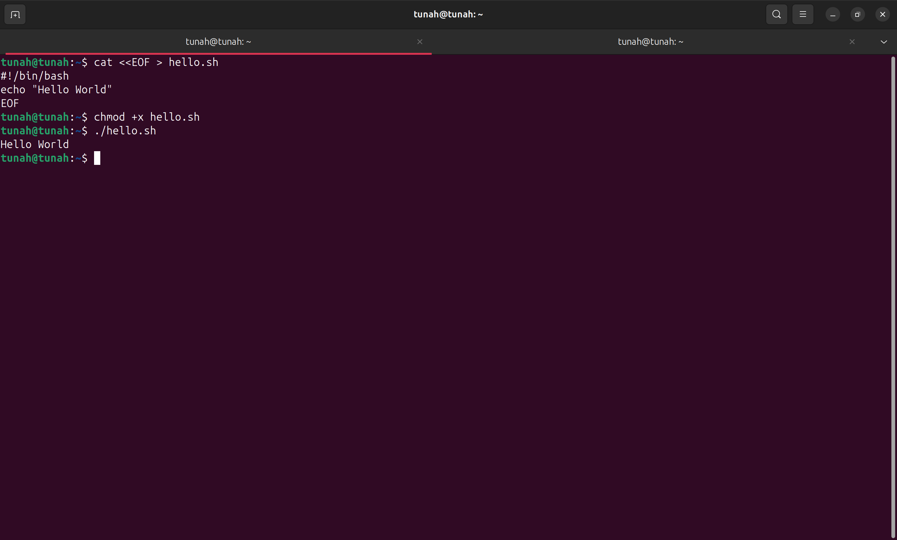

---

## Bài tập 2: Script in ngày giờ hiện tại

### Yêu cầu
Tạo script `current_time.sh` hiển thị ngày và giờ hiện tại.

### Thực hiện

```bash
cat <<EOF > current_time.sh
#!/bin/bash
echo "Ngày và giờ hiện tại: $(date)"
EOF
chmod +x current_time.sh
./current_time.sh
```

> **Lưu ý:** Khi dùng `cat <<EOF` với `$(date)`, lệnh `date` sẽ được thực thi ngay lúc tạo file. Để giữ nguyên `$(date)` trong script, dùng `cat <<'EOF'` (có ngoặc đơn) hoặc escape bằng `\$(date)`:
>
> ```bash
> cat <<'EOF' > current_time.sh
> #!/bin/bash
> echo "Ngày và giờ hiện tại: $(date)"
> EOF
> ```

📸 **Screenshot 2**: Chụp nội dung script (`cat current_time.sh`) và kết quả chạy hiển thị ngày giờ.

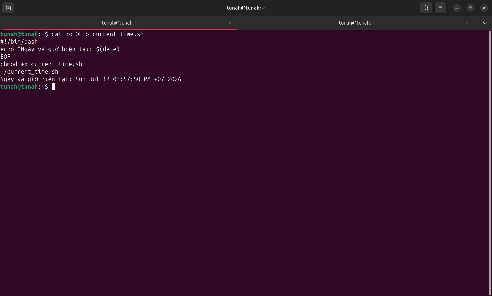

---

## Bài tập 3: Script tính tổng hai số

### Yêu cầu
Tạo script `sum.sh` — nhập 2 số từ bàn phím, in ra tổng.

### Thực hiện

```bash
cat <<'EOF' > sum.sh
#!/bin/bash
read -p "Nhập số thứ nhất: " num1
read -p "Nhập số thứ hai: " num2
sum=$((num1 + num2))
echo "Tổng của $num1 và $num2 là: $sum"
EOF
chmod +x sum.sh
./sum.sh
```

> Khi chạy, nhập 2 số bất kỳ (ví dụ: 15 và 25).

📸 **Screenshot 3**: Chụp nội dung script và kết quả chạy — hiển thị prompt nhập số và kết quả tổng.

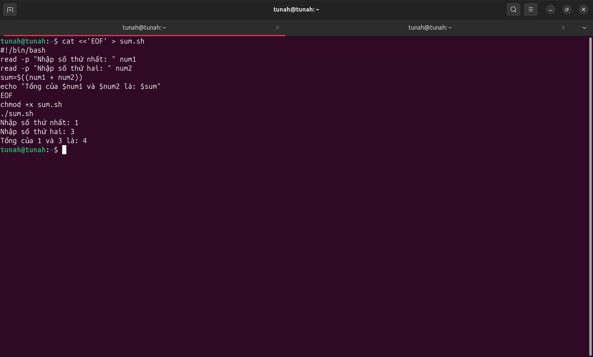

---

## Bài tập 4: Script kiểm tra file tồn tại

### Yêu cầu
Tạo script `check_file.sh` — nhập tên file, kiểm tra tồn tại hay không.

### Thực hiện

```bash
cat <<'EOF' > check_file.sh
#!/bin/bash
read -p "Nhập tên tập tin cần kiểm tra: " filename
if [ -f "$filename" ]; then
    echo "Tập tin '$filename' tồn tại."
else
    echo "Tập tin '$filename' không tồn tại."
fi
EOF
chmod +x check_file.sh
./check_file.sh
```

> Test với file tồn tại (ví dụ: `hello.sh`) và file không tồn tại (ví dụ: `abc.txt`).

📸 **Screenshot 4**: Chụp 2 lần chạy — 1 lần với file tồn tại (thông báo "tồn tại"), 1 lần với file không tồn tại (thông báo "không tồn tại").

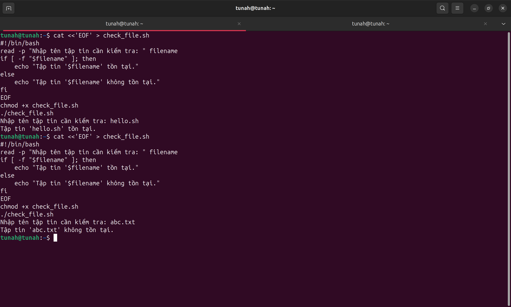

---

## Bài tập 5: Script liệt kê file trong thư mục

### Yêu cầu
Tạo script `list_files.sh` liệt kê các file trong thư mục hiện tại.

### Thực hiện

```bash
cat <<'EOF' > list_files.sh
#!/bin/bash
echo "Các file trong thư mục hiện tại:"
ls -la
EOF
chmod +x list_files.sh
./list_files.sh
```

📸 **Screenshot 5**: Chụp kết quả chạy — danh sách file trong thư mục hiện tại.

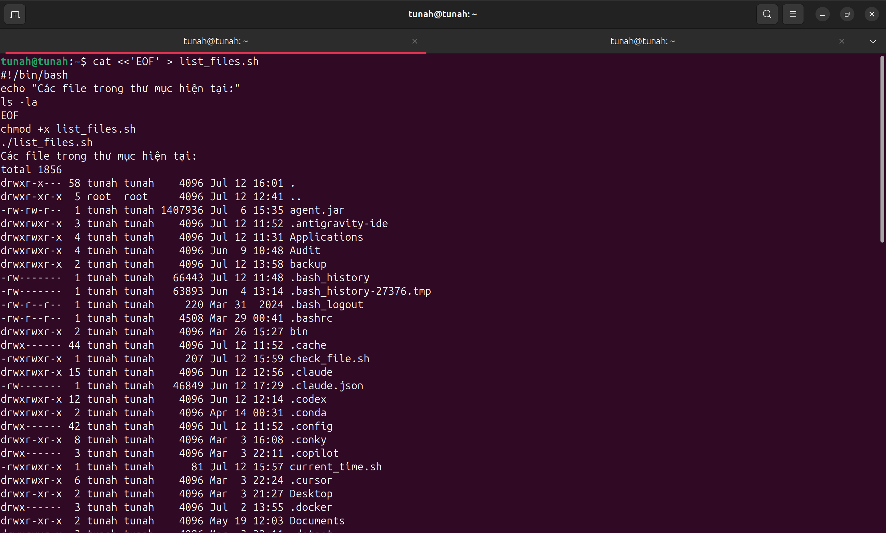

---

## Bài tập 6: Script in số từ 1 đến 10

### Yêu cầu
Tạo script `loop_numbers.sh` — dùng vòng lặp in số từ 1 đến 10.

### Thực hiện

```bash
cat <<'EOF' > loop_numbers.sh
#!/bin/bash
for i in {1..10}
do
    echo $i
done
EOF
chmod +x loop_numbers.sh
./loop_numbers.sh
```

📸 **Screenshot 6**: Chụp nội dung script và kết quả chạy — in các số 1 đến 10.

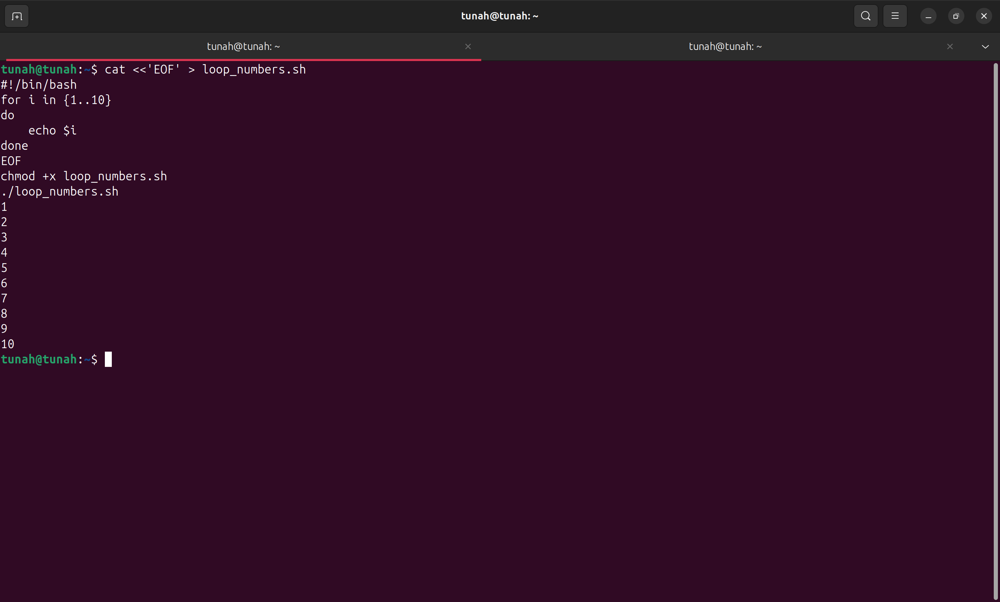

---

## Bài tập 7: Script in số từ 1 đến 100

### Yêu cầu
Sao chép `loop_numbers.sh` thành `loop_numbers_100.sh`, sửa để in 1–100.

### Thực hiện

#### Bước 1: Sao chép file

```bash
cp loop_numbers.sh loop_numbers_100.sh
```

#### Bước 2: Sửa file (đổi {1..10} thành {1..100})

```bash
sed -i 's/{1..10}/{1..100}/g' loop_numbers_100.sh
```

Hoặc mở bằng `vi loop_numbers_100.sh` và sửa thủ công.

#### Bước 3: Chạy script

```bash
./loop_numbers_100.sh
```

📸 **Screenshot 7**: Chụp kết quả — in các số từ 1 đến 100 (có thể chỉ cần chụp phần đầu 1–10 và phần cuối 90–100).

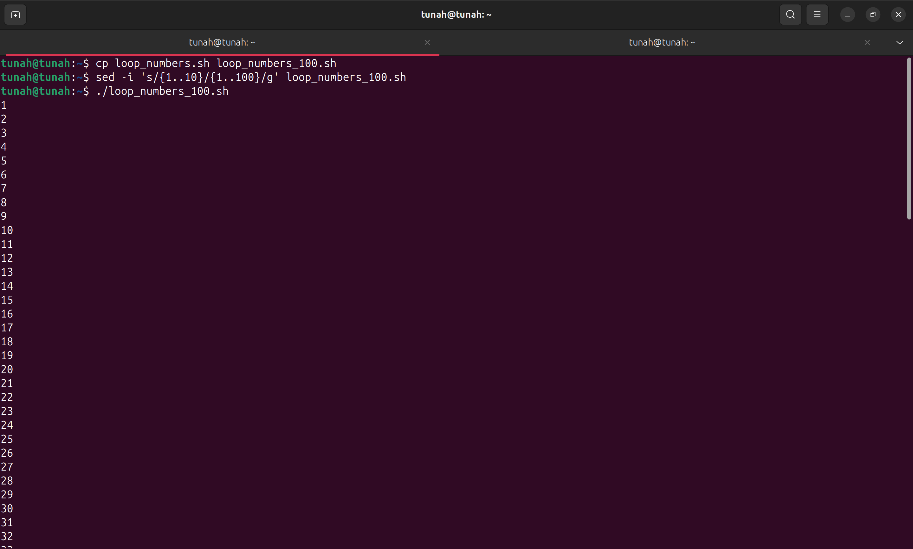

---

## Bài tập 8: Script đếm số dòng file

### Yêu cầu
Tạo script `count_lines.sh` — nhập tên file, đếm số dòng.

### Thực hiện

```bash
cat <<'EOF' > count_lines.sh
#!/bin/bash
read -p "Nhập tên file: " filename
if [ -f "$filename" ]; then
    lines=$(wc -l < "$filename")
    echo "File '$filename' có $lines dòng."
else
    echo "File '$filename' không tồn tại."
fi
EOF
chmod +x count_lines.sh
./count_lines.sh
```

> Nhập tên một file đã có (ví dụ: `hello.sh`).

📸 **Screenshot 8**: Chụp kết quả chạy — hiển thị số dòng của file.

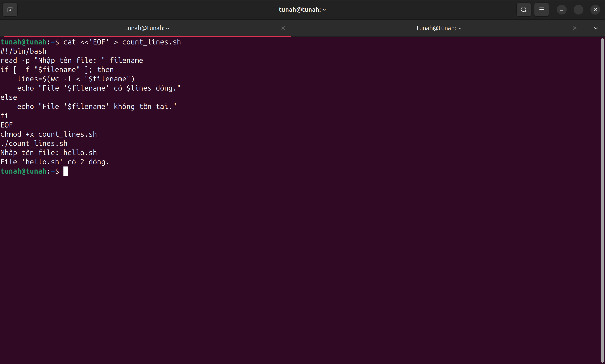

---

## Bài tập 9: Script sao lưu file kèm ngày tháng

### Yêu cầu
Tạo script `backup_file.sh` — nhập tên file, tạo bản sao có tên kèm ngày tháng.

### Thực hiện

```bash
cat <<'EOF' > backup_file.sh
#!/bin/bash
read -p "Nhập tên file cần sao lưu: " filename
if [ -f "$filename" ]; then
    backup_name="${filename}_$(date +%Y%m%d_%H%M%S)"
    cp "$filename" "$backup_name"
    echo "Đã sao lưu '$filename' thành '$backup_name'"
else
    echo "File '$filename' không tồn tại."
fi
EOF
chmod +x backup_file.sh
./backup_file.sh
```

> Nhập tên file (ví dụ: `hello.sh`).

Kiểm tra:

```bash
ls -la hello.sh*
```

📸 **Screenshot 9**: Chụp kết quả chạy + `ls` — file backup tên dạng `hello.sh_20260712_120000`.

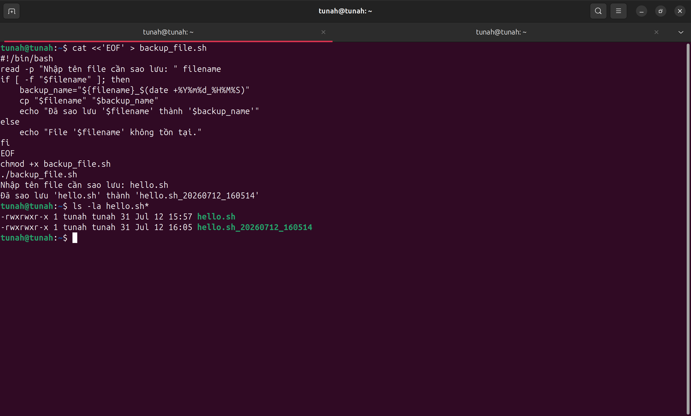

---

## Bài tập 10: Crontab chạy script 2 phút một lần

### Yêu cầu
- Tạo script `run_script.sh` in "Script dang chay" vào file `output.log`.
- Thiết lập crontab chạy mỗi 2 phút.

### Hướng dẫn thực hiện

#### Bước 1: Tạo script

```bash
cat <<'EOF' > ~/run_script.sh
#!/bin/bash
echo "Script dang chay - $(date)" >> ~/output.log
EOF
chmod +x ~/run_script.sh
```

#### Bước 2: Thiết lập crontab

```bash
crontab -e
```

> Thêm dòng sau vào cuối file:
> ```
> */2 * * * * /bin/bash ~/run_script.sh
> ```
> Lưu và thoát.

#### Bước 3: Kiểm tra crontab đã thiết lập

```bash
crontab -l
```

📸 **Screenshot 10**: Chụp kết quả `crontab -l` — dòng cron đã được thêm.

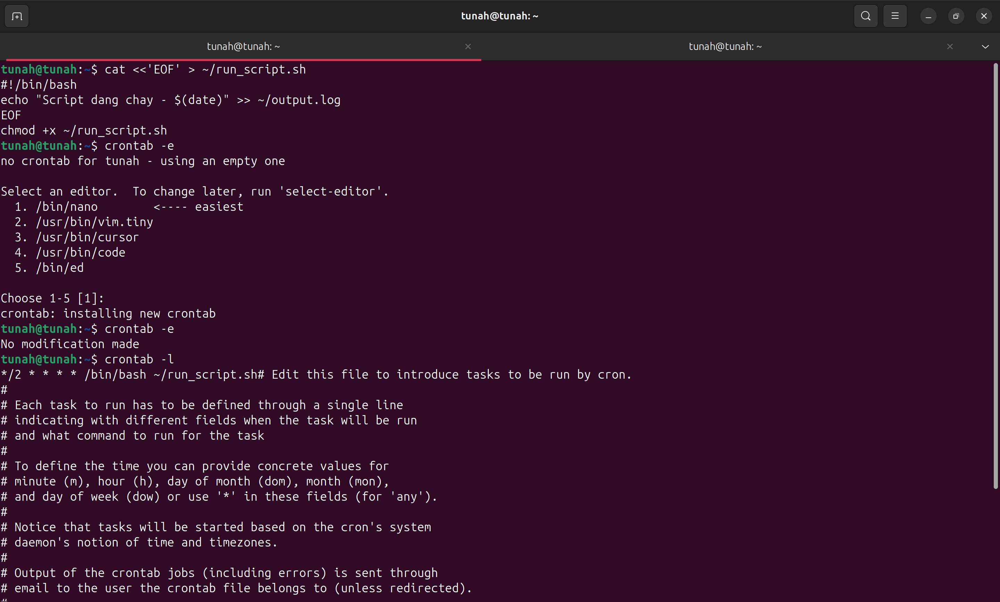

#### Bước 4: Chờ vài phút rồi kiểm tra output

```bash
cat ~/output.log
```

📸 **Screenshot 11**: Chụp kết quả `cat ~/output.log` — nhiều dòng "Script dang chay" với timestamp khác nhau.

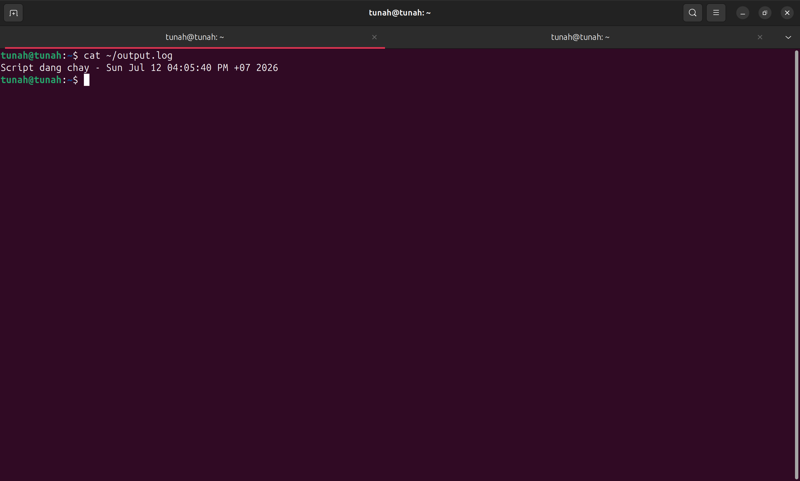

---

## Bài tập 11: Tự động sao lưu thư mục hàng ngày

### Yêu cầu
- Tạo script sao lưu thư mục `~/myfolder` vào `~/backup`.
- Thiết lập crontab sao lưu lúc 2 giờ sáng hàng ngày.

### Hướng dẫn thực hiện

#### Bước 1: Tạo thư mục test

```bash
mkdir -p ~/myfolder
echo "test data" > ~/myfolder/testfile.txt
```

#### Bước 2: Tạo script backup

```bash
cat <<'EOF' > ~/backup.sh
#!/bin/bash
backup_dir=~/backup/backup_$(date +%Y%m%d_%H%M%S)
mkdir -p "$backup_dir"
cp -r ~/myfolder/* "$backup_dir/"
echo "Backup completed at $(date)" >> ~/backup/backup.log
EOF
chmod +x ~/backup.sh
```

#### Bước 3: Test thủ công

```bash
~/backup.sh
ls -la ~/backup/
```

📸 **Screenshot 12**: Chụp kết quả — thư mục backup chứa dữ liệu sao lưu.

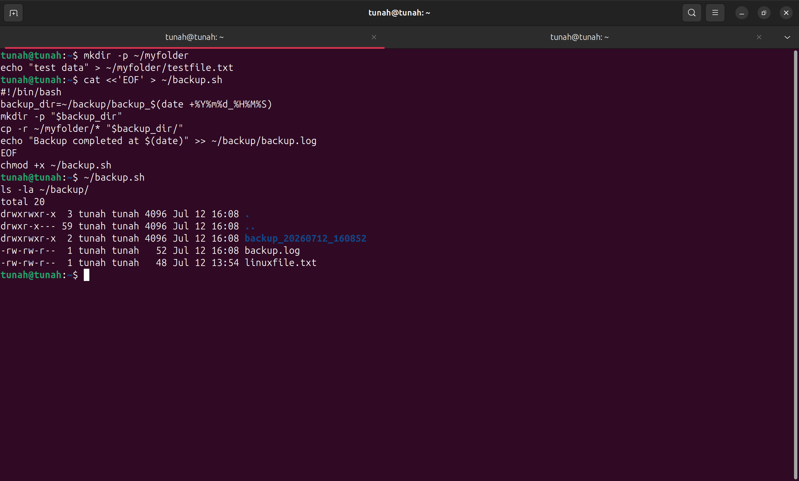

#### Bước 4: Thiết lập crontab

```bash
crontab -e
```

> Thêm dòng:
> ```
> 0 2 * * * /bin/bash ~/backup.sh
> ```

#### Bước 5: Kiểm tra crontab

```bash
crontab -l
```

📸 **Screenshot 13**: Chụp kết quả `crontab -l` — cả 2 dòng cron (bài 10 + bài 11).

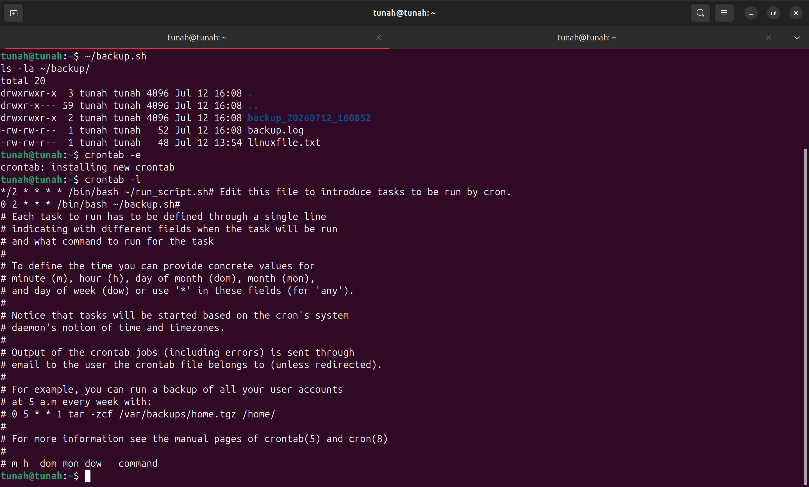

---

## Tổng hợp Screenshot cần chụp

| # | Nội dung screenshot | Lệnh/Script liên quan |
|---|---------------------|------------------------|
| 1 | hello.sh — nội dung + kết quả | `cat hello.sh` + `./hello.sh` |
| 2 | current_time.sh — nội dung + kết quả | `cat current_time.sh` + `./current_time.sh` |
| 3 | sum.sh — nhập 2 số + tổng | `./sum.sh` |
| 4 | check_file.sh — 2 trường hợp | `./check_file.sh` (x2) |
| 5 | list_files.sh — danh sách file | `./list_files.sh` |
| 6 | loop_numbers.sh — in 1–10 | `./loop_numbers.sh` |
| 7 | loop_numbers_100.sh — in 1–100 | `./loop_numbers_100.sh` |
| 8 | count_lines.sh — đếm dòng | `./count_lines.sh` |
| 9 | backup_file.sh — file backup có date | `./backup_file.sh` + `ls` |
| 10 | Crontab đã thiết lập | `crontab -l` |
| 11 | output.log có nhiều dòng | `cat ~/output.log` |
| 12 | Thư mục backup có dữ liệu | `ls -la ~/backup/` |
| 13 | Crontab có cả 2 job | `crontab -l` |
